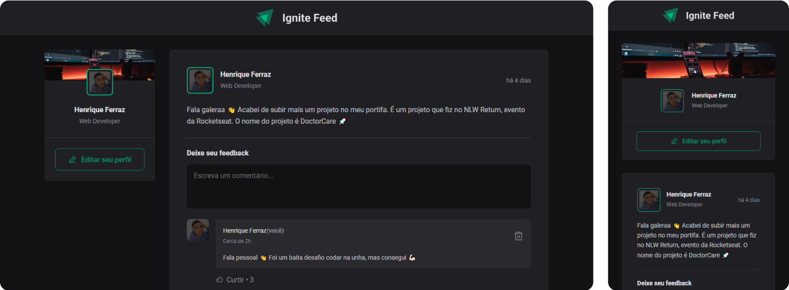
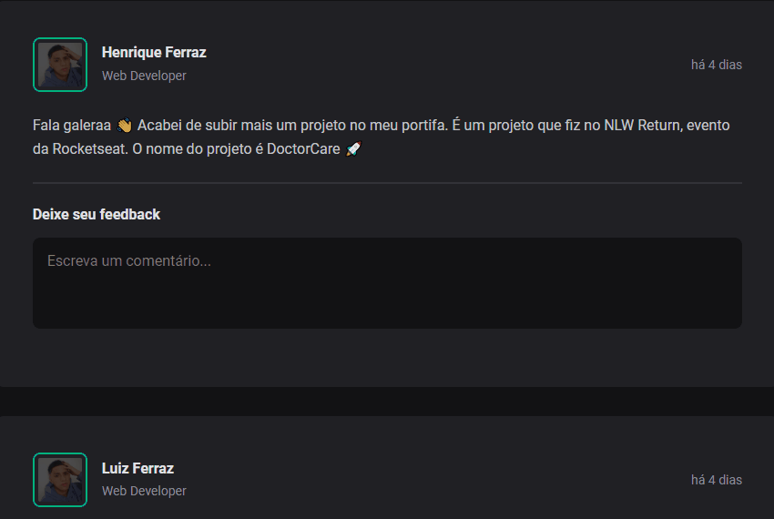
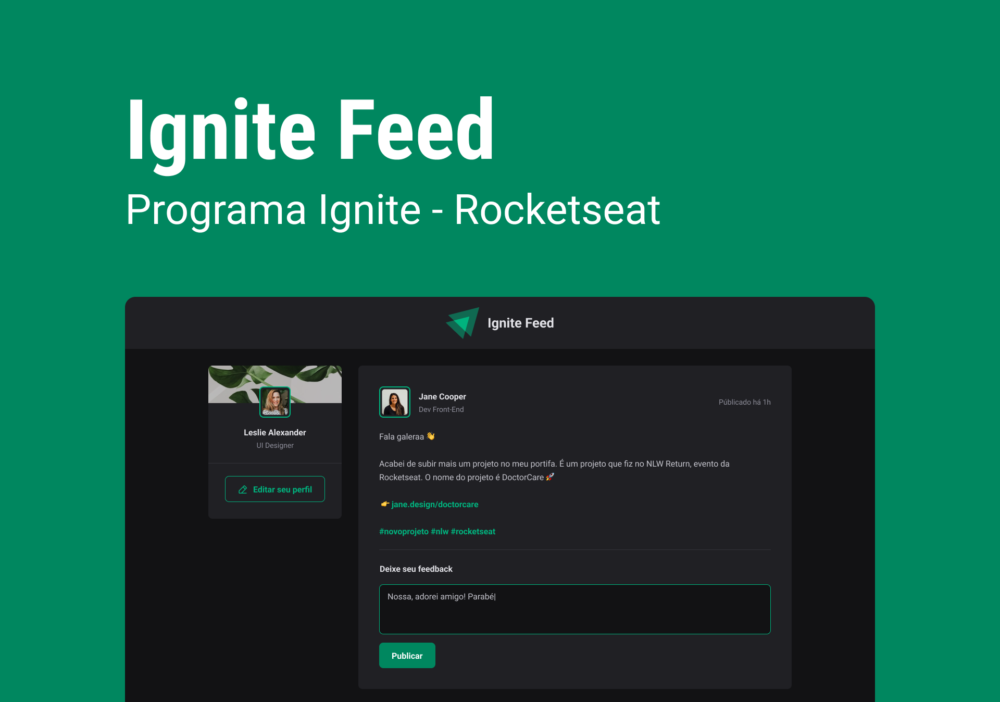

<h1 align="center">
  
</h1>

<div align="center">
  <a href="#📸-project-view">📸 Project View</a> -
  <a href="#ℹ-about-the-project">ℹ About the Project</a> -
  <a href="#🏗-main-features">🏗 Main Features</a> -
  <a href="#⚙️-technologies">⚙️ Technologies</a> -
  <a href="#🧪-test-the-project---click-on-the-button">🧪 Test the Project</a> -
  <a href="#🎨-layout">🎨 Layout</a> -
  <a href="#💻-repository-cloning">💻 Repository Cloning</a> -
  <a href="#🤝-contributions">🤝 Contributions</a> -
  <a href="#👨‍💻-author">👨‍💻 Author</a>
</div>

## 📸 Project View

<div align="center">
  
  
</div>

## ℹ About the Project

<p>
  Ignite Feed is the representation of a content-sharing platform through posts and comments. The goal of this project was to provide a real and practical development environment dedicated to applying the essential principles of React JS. This was an initial project developed during my journey on the React JS track designed by Rocketseat, where I had the opportunity to deepen my knowledge in React JS, and now I share this experience with you.
</p>

## 🏗 Main Features

- [x] Comments: Users can comment on other users' posts.

- [x] Like Comments: Users have the ability to like comments.

- [x] Delete Comments: Users have the ability to delete comments on posts.

## ⚙️ Technologies

- <a href="https://vitejs.dev/"> Vite</a>
- <a href="https://react.dev/"> React JS</a>
- <a href="https://www.typescriptlang.org/"> TypeScript</a>

## 🧪 Test the Project - Click on the button

<a href="https://ignite-feed-black-mu.vercel.app/">
  
</a>

## 🎨 Layout

<a align="center" href="https://www.figma.com/community/file/1113573231685349036">
  
</a>

## 💻 Repository Cloning

1. **Requirements:** Make sure you have the following software installed on your system:

- <a href="https://git-scm.com/"> GIT</a>
- <a href="https://nodejs.org/"> Node JS</a>

2. **Clone the Repository:** Make a clone of this repository to your development environment using the following command:

```bash
git clone https://github.com/HenriqueFerraz27/ignite-feed.git
```

3. **Dependency Installation:** Navigate to the project folder and install the necessary dependencies with the following command:

```bash
npm install # or yarn install
```

4. **Server Run:** Start the development server with the following command:

```bash
npm run dev # or yarn dev
```

5. **Application Access:** Open your browser and access the link provided to use Ignite Feed.

## 🤝 Contributions

If you would like to contribute to the project, please follow the contribution guidelines below:

1. Fork the repository on GitHub.

2. Create a new branch for your contribution:

```bash
git checkout -b feature/your-contribution
```

3. Make any necessary changes, and test them to ensure that the changes are robust and reliable.

4. Submit your changes with a pull request (PR).

5. After review and approval, your changes will be incorporated into the project.

## 👨‍💻 Author

<a href="https://github.com/HenriqueFerraz27">

</a>
<br>

🌌 Building connections across the code universe, [Henrique Frraz](https://www.linkedin.com/in/henriqueferraz277) 🚀
